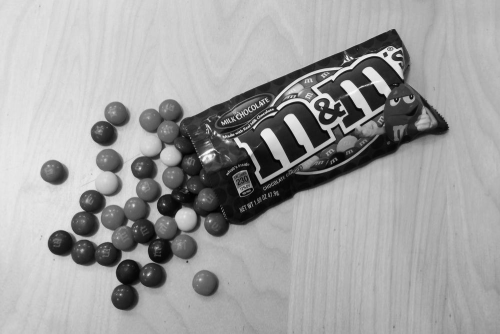
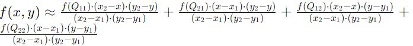

## 報告110590018劉承翰

### Q1_1
利用python矩陣運算來將BGR依照公式來進行轉換
$pixel = (0.3\times R)+(0.59\times G)+(0.11\times B)$
](img1_q1-1.png)

### Q1_2
利用Q1_1的灰階照片並以128當作閥值來進行二值化處理

### Q1_3

- 先間圖片分成大小為3的區塊，並算出區塊的相素平均值，並依照算出來的平均值依序儲存在ColorList中，假如List中的相素與當下的採樣的相素相近，該相素對應的計數器加1，進而得到圖片中出現頻率最高的相素點。
- 將原始圖片與ColorList做比較，取代成相近的ColorList中的相素點

    color : ['0x56afdb', '0x50acd7', '0x96dcf9', '0x41e3e', '0x6fc5e9', '0x10724', '0x324870', '0x3f97c9', '0x1a366d', '0xafd1df', '0x40e91', '0x698fa2', '0x1430b4', '0x222d2', '0x47627c', '0x8faab8'] 

    color : ['0x788699', '0xc3d2e2', '0xa2b0c3', '0xc7d6e6', '0x1f3a4e', '0x355364', '0x83a2c1', '0x7c8a9d', '0x7ea0be', '0x435e72', '0x576578', '0x31729', '0xa7c2e4', '0x6382a1', '0x4e7492', '0x253d4e']

    color : ['0x5ba482', '0x74c7a0', '0x509d7e', '0x98b0e8', '0xefd8c3', '0xecc38c', '0x7d8fb8', '0xeecfa2', '0x64749c', '0xf9f9f7', '0x568357', '0x545f74', '0x6ac6f2', '0x451d1c', '0xb0d21', '0x3d9d72']

    

### Q2_1
- 兩倍

利用img[x * 2, y * 2],img[x * 2, y],[x, y * 2]等於img[x, y]來將原始圖片放大成兩倍
 
 

- 二分之一倍

只記錄img[x * 2, y * 2]來將圖片縮小

 
 

### Q2_2
- 兩倍

利用已知四點相素與雙線性插值公式來取得中間區域的相素點

](../image.png)

 
 

- 二分之一倍

利用已知四點相素平均來取得中間區域的相素點

 
 

