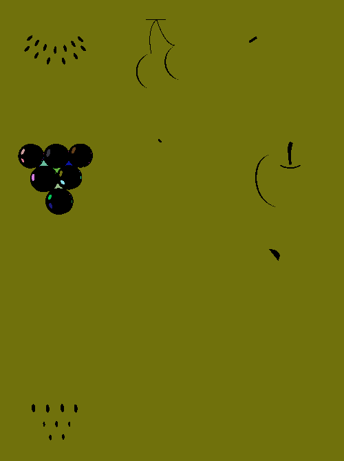
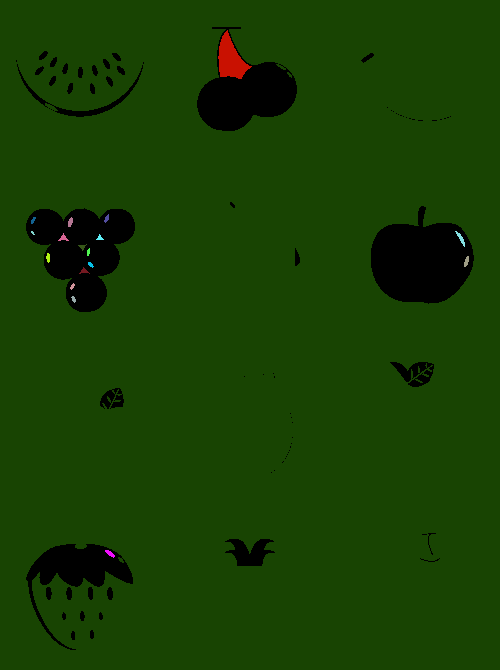

### Report 110590018劉承翰

- 4-connected

    先創建一個與image相同大小並設為0的`labeled_img`，接著利用DFS尋訪每個pixel，當`labeled_img`相對pixel為0、image的pixel!=0時就執行`stack.extend([(cx+1, cy), (cx-1, cy), (cx, cy+1), (cx, cy-1)])`，來新增新的點，而pixel!=0當label的假如當`stack`沒有point時將label加一，這代表著該label的值無法繼續延伸下去。

   

- 8-connected

    先創建一個與image相同大小並設為0的`labeled_img`，接著利用DFS尋訪每個pixel，當`labeled_img`相對pixel為0、image的pixel!=0時就執行`stack.extend([(cx+1, cy), (cx-1, cy), (cx, cy+1), (cx, cy-1),(cx-1, cy-1), (cx+1, cy-1), (cx+1, cy+1), (cx-1, cy+1)])`，來新增新的點，而pixel!=0當label的假如當`stack`沒有point時將label加一，這代表著該label的值無法繼續延伸下去。
       

- generate_random_color

    隨機生成顏色

```python=
    def generate_random_color():
        return [random.randint(0, 255) for _ in range(3)]
```

## Issue

1. 我本來用recursive來寫尋訪，結果超過python的最大深度:D
2. 改成用for寫後，遇到Two-Pass Algorithm成效不佳的問題，因為圖片會有超多色塊，需要寫到20幾次才能讓色塊變得不那麼雜，但這樣相比於這個程式跑超級久。
