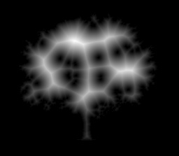
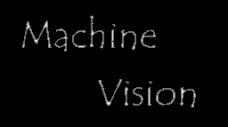
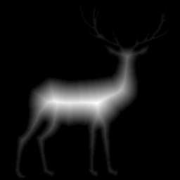
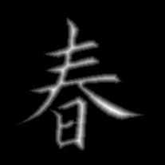
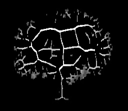
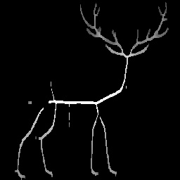
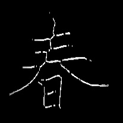
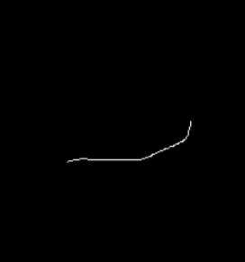
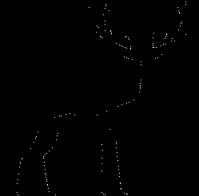
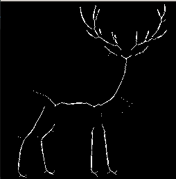

## Report 110590018劉承翰

### Distance_map

先將圖片進行二值化，然後透過255-image來將黑白交換，方便接下來的處理，之後透過edge_detect得出邊緣個點的座標。尋訪每個edge的座標並與當前座標進行距離運算並寫入對應點的dictionary(`edge_coordinates`)，之後再利用min函數得到距離的最小值並寫進array(`distance_img`)，最後將正規化為0~255的數值(`dist_img_8bit`)，並將type改為uint8，這目的是為了能正常顯示image。當中的鹿圖中的鹿角因為distance小的關係，讓他在正規化之後看起來很淡，所以透過用logarithmic transformation來增加對比度

 
 
 

### Skeleton

尋訪`dist_img_8bit`並記錄周圍的最大值，之後在與'dist_img_8bit'一樣大的array輸入記錄點`current_img`，最後透過dilate與close把斷掉的點連起來
 
 
 

## Experience

在研究Skeleton用到ZHANG Algorithm、Thinning、erode與dilate算出skeleton，但結果都無法讓四張圖的Skeleton可以完整地顯示出來，像是用Thinning的話鹿只剩軀幹一條線，我覺得Thinning比較適合用在OCR的方面，至於用在比較複雜的圖的話效果不好。ZHANG Algorithm沒用到distance_map，不符合題目，而且效果也不好，所以就不用它啦:D，最後回到了取local_max的方法，假如單純的取local_max他的斷點會超級多，所以我加了一個offset讓他在範圍內的話就輸入點，雖然減少了很多斷點，但還是無法把整個物件連在一起，我中間有嘗試過用label的方式去把斷點連在一起，但有字母那張圖片的話就沒辦法這樣用了，所以我後來就用型態學的方法把斷點連在一起。

- thinning

- ZHANG Algorithm

- erode and dilate

    這方法真的挺有趣的，他先透過erode再dilate，之後再讓原圖減去，這樣就可以獲得skeleton最外圍那層。