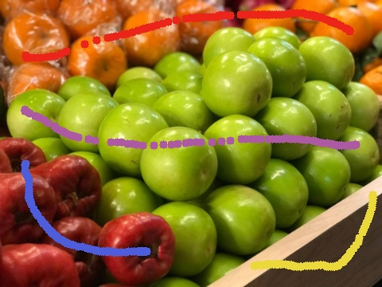
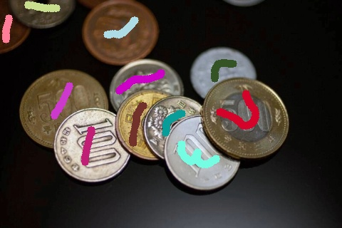
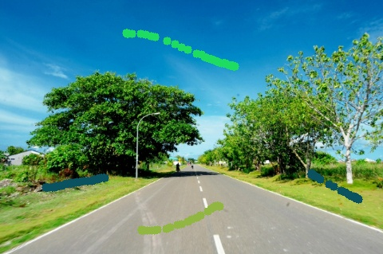
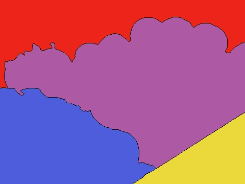
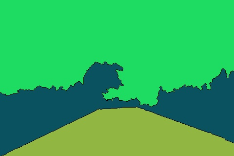

# Report 110590018劉承翰

## Q1

利用`cv2.setMouseCallback(`image`, draw)`來達到對圖片進行標記，至於顏色的部分，是用random隨機產生15個colors，最後使用`markers`來儲存標記的顏色與狀態(未標記or標記顏色)。p.s.畫完一個區域按n切換下個label，全部完成按q

  

## Q2

算出圖片梯度`gradient`，尋訪每個pixel，假如該pixel有大於0的值，將該值的4-neighbors的梯度與座標寫入`priority_queue`，接著取出`priority_queue`優先級最高的值進行計算，達到從內部到邊緣的區域擴展。如果該值的neighbor只有一種label的話，則將該label賦予對應座標的`markers`，兩個以上代表該點為邊緣，接著再次push到`priority_queue`，直到整個照片都標記完成。

  

## 心得

雖然跟connect-component差不多，但這次的標記是用BFS的概念，所以做起來蠻熟悉的:D。但也透過這次的功課讓我體會到自己的不足之處，我沒辦法從頭產出這個功能，只能上網找code跟問chatgpt :(，盡力局。

