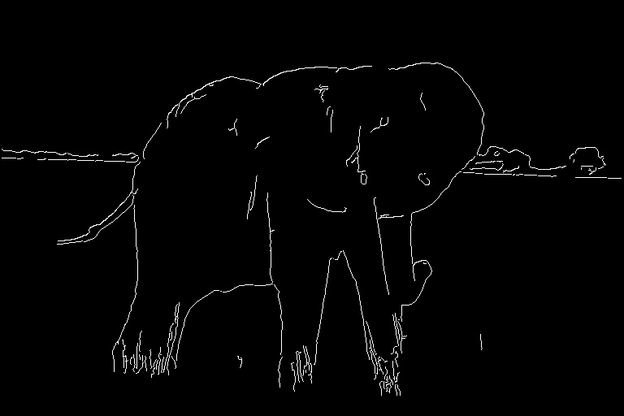

# Report 110590018 劉承翰

## Result
 
 

## Step

**Step 1**: 

    Convert to gray scale

**Step 2**: 

    Apply Gaussian filter with sigma=1.1 and filter size=5*5

**Step 3**:
    
    Calculate the gradient and angle for each pixel

**Step 4**: 

    Round the angles to 0, 45, 90, or 135 degrees

**Step 5**: 

    Suppress non-maximum values for angles 0, 45, 90, and 135 degrees

**Step 6**: 

    Use double thresholding with 50 and 140 to find weak edges and strong edges

**Step 7**: 

    Use DFS to connect weak edges to nearby strong edges

**Step 8**: 

    Obtain the final edges

